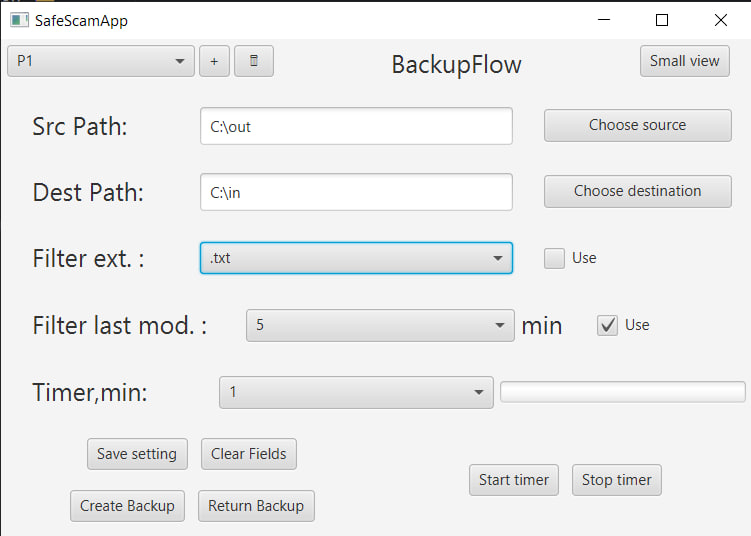

# Backup Flow

Приложение для автоматического резервного копирования файлов .

## Функционал

### Управление профилями резервирования
- Создание/редактирование нескольких профилей настроек
- Сохранение параметров:
    - Исходная папка (`source`)
    - Целевая папка (`destination`)
    - Правила фильтрации
    - Автоматическое копирование по таймеру:
        - Каждые 1/15/30 минут

### Быстрый доступ
- Компактное окно поверх всех приложений

### Фильтрация файлов
- По расширению, тех файлов которые есть в source
- По времени последнего изменения
- Комбинированные условия

## Технологии
- JavaFX
- XML/JSON для хранения профилей
- `java.nio.file` для работы с файлами

## Скриншот

